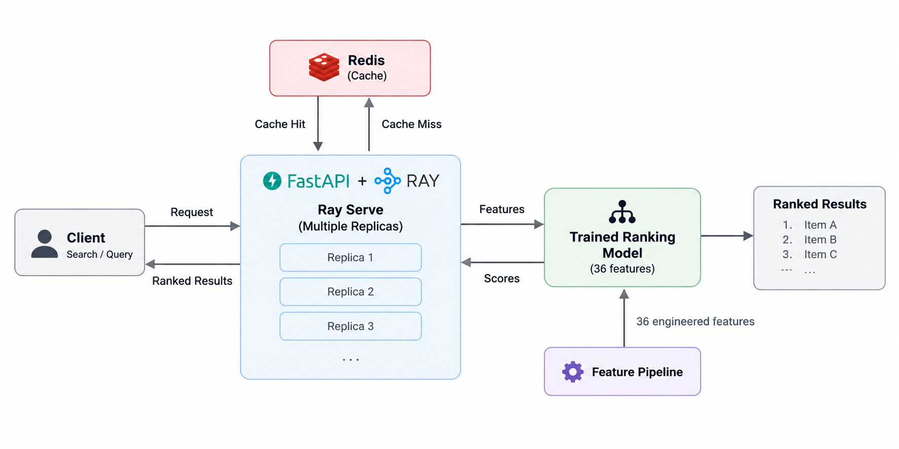

# Distributed ML Inference & Ranking

<p align="center">
  
</p>

Production-oriented recommendation system built on the Twitch 100K dataset, covering candidate retrieval, feature construction, ranking, serving, caching, containerization, load testing, and CI.

## System

```text
Request
  ↓
FastAPI / Ray Serve
  ↓
Redis cache
  ↓ miss
Hybrid candidate retrieval
  ↓
36-feature inference
  ↓
HistGradientBoosting ranker
  ↓
Top-K recommendations
```

Candidate retrieval combines user history, SVD collaborative retrieval, and popularity fallback using weighted reciprocal-rank fusion.

Serving uses FastAPI with Ray Serve replicas and Redis-backed recommendation caching.

## Results

### Ranking

| Metric | HGB |
|---|---:|
| ROC-AUC | 0.9633 |
| Average Precision | 0.9262 |
| MRR | 0.9866 |
| Recall@10 | 0.9405 |
| NDCG@10 | 0.9616 |

HistGradientBoosting was selected after comparison with logistic regression, a neural ranker, and a popularity baseline.

### Candidate retrieval

| Metric | Value |
|---|---:|
| Raw Recall@200 | 0.7413 |
| Catalog Recall@200 | 0.7787 |
| Repeat Recall@200 | 0.9997 |
| New-item Recall@200 | 0.4914 |
| Catalog coverage | 0.9510 |

### Inference path

| Stage | Mean latency |
|---|---:|
| Candidate retrieval | 0.48 ms |
| 36-feature construction | 1.87 ms |
| Ranking + Top-K | 5.56 ms |
| Total inference path | 7.90 ms |

Indexed feature lookups reduced feature-construction latency by roughly 183× while preserving parity with the notebook implementation.

### Ray Serve scaling

100 requests, concurrency 10, local CPU benchmark.

| Replicas | Throughput | HTTP P50 | HTTP P95 |
|---:|---:|---:|---:|
| 1 | 106.96 req/s | 85.5 ms | 120.0 ms |
| 2 | 150.68 req/s | 62.3 ms | 89.2 ms |
| 4 | 138.99 req/s | 59.4 ms | 83.5 ms |

Two replicas delivered the highest throughput on the tested machine.

### Dockerized load test

Locust, 10 users, 2-minute run.

| Request type | Requests | Failures | P50 | P95 | P99 |
|---|---:|---:|---:|---:|---:|
| Cache hit | 7,058 | 0 | 4 ms | 10 ms | 28 ms |
| Cache miss | 1,464 | 0 | 21 ms | 47 ms | 160 ms |
| Overall | 8,522 | 0 | 5 ms | 25 ms | 69 ms |

Observed cache-hit rate: 82.8%.

## Stack

Python · pandas · scikit-learn · PyTorch · FastAPI · Ray Serve · Redis · Docker · Locust · GitHub Actions

## Project structure

```text
src/
├── api/            FastAPI application
├── cache/          Redis cache
├── distributed/    Ray Serve deployment
├── features/       production feature construction
├── inference/      inference engine
├── ranking/        ranking model wrapper
├── retrieval/      candidate generation
└── validation/     feature parity checks

artifacts/           trained model and retrieval artifacts
data/processed/      processed inference data
load_tests/          Locust workload
scripts/             Docker smoke test
results/             benchmark outputs
```

## Run

```bash
docker compose up --build
```

Health check:

```bash
curl http://127.0.0.1:8000/health
```

Recommendation request:

```bash
curl http://127.0.0.1:8000/recommend/1
```

Stop:

```bash
docker compose down
```

## Validation

Feature parity:

```bash
python -m src.validation.feature_parity --sample-size 100 --project-root .
```

Docker smoke test:

```bash
./scripts/docker_smoke_test.sh
```

GitHub Actions runs source compilation, feature-parity validation, Docker Compose validation, and Docker image builds on pushes and pull requests to `main`.

---

This project demonstrates single-node, multi-replica ML inference serving. Benchmark results reflect the tested local environment and are not hardware-independent capacity claims.
